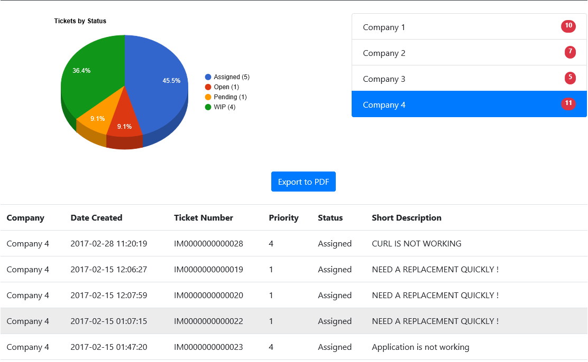

# Creating pie charts dynamically and exporting to PDF.

I've been assigned to build reports for one of the applications I currently support with these requirements:

- [x] Include a pie chart
- [x] List of all tickets that haven't been closed so support team can take care of them
- [x] Have the ability to export to PDF 

This is how it should look in the web page:

And here's the file export to [PDF](samples/Tickets.pdf)

## JavaScript libraries used on this project

- [x] Google Charts
- [x] jsPDF
- [x] jsPDF-Autotable
- [x] Waiting Dialog

### Installation
No extra steps are required just clone this repository to your local environment and open the index.html page.

## Acknowledgments

* [Google Charts](https://developers.google.com/chart/)
* [James Hall](https://github.com/MrRio/jsPDF)
* [Simon Bengtsson](https://github.com/simonbengtsson/jsPDF-AutoTable)
* [Eugene Maslovich](https://github.com/ehpc/bootstrap-waitingfor)
